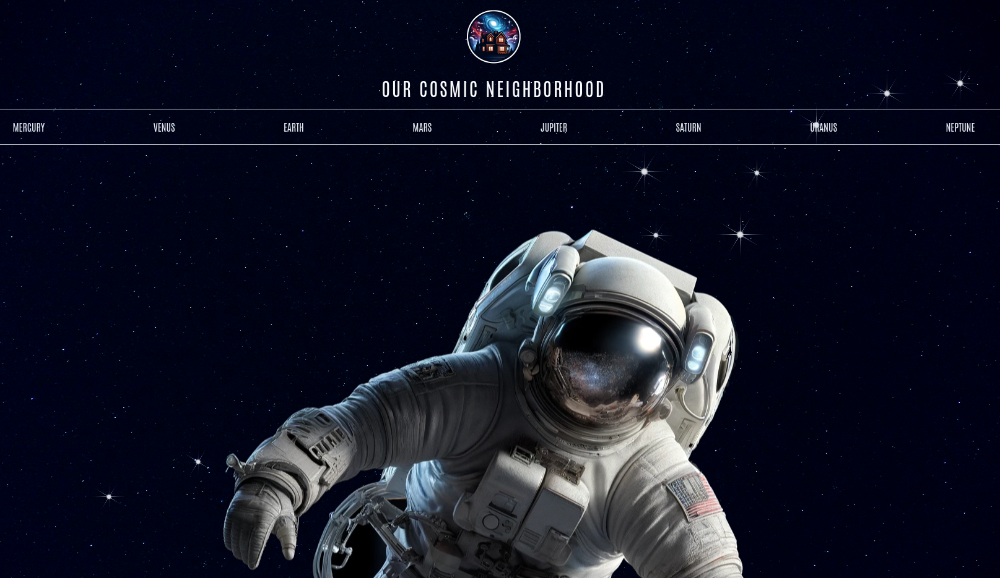
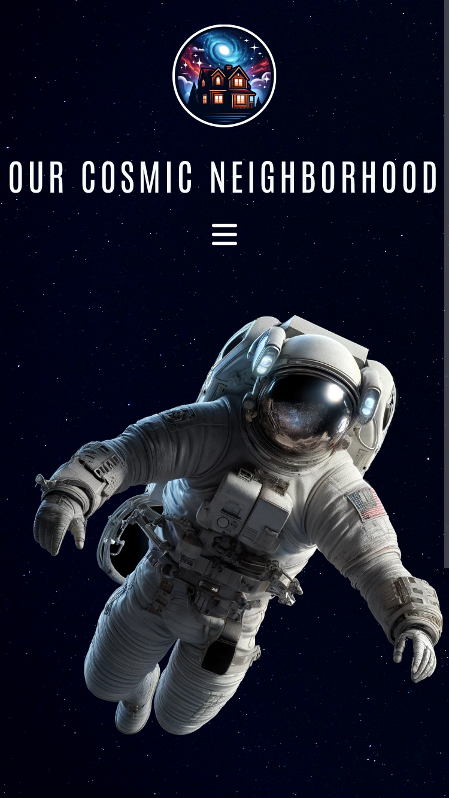

# Cosmic Neighborhood

**Live Site:** [CosmicNeighborhood](https://dev-jlagunas.github.io/cosmic-neighborhood/#/)

Cosmic Neighborhood is an expanded and enhanced version of a Frontend Mentor challenge, showcasing an immersive and interactive space-themed website. Users can explore comprehensive information about the planets in our solar system, with each planet having its own dedicated page, complete with tabs for detailed information.

One of the standout features of this project is the interactive 3D models of the planets, created using Three.js. Users can zoom in, view the planets from different angles, and engage with the models for a more dynamic experience.

This project is built with modern web technologies, including Vue, SCSS, and Tailwind CSS, ensuring a smooth and visually appealing user experience.

## Features

- **Space-Themed UI:** A captivating design that immerses users in a cosmic experience.
- **Dedicated Planet Pages:** Each planet has its own page with detailed information presented in organized tabs.
- **Interactive 3D Models:** Created with Three.js, these models allow users to explore planets interactively.
- **Advanced Animations:** Enhanced animations that bring the site to life.
- **Modern Web Technologies:** Built with Vue, SCSS, and Tailwind CSS for a seamless and responsive user interface.
- **Responsive Design:** The site is fully responsive, ensuring a seamless experience across various devices and screen sizes.
- **Smooth Navigation:** Intuitive navigation with a sidebar menu that allows users to easily switch between different planet pages.
- **Educational Content:** Rich, educational content that provides in-depth information about each planet, including its composition, atmosphere, and more.
- **Performance Optimizations:** Optimized for performance to ensure fast load times and smooth interactions, even with complex 3D models.
- **Accessible Design:** Ensures that the site is accessible to users with disabilities, following best practices for web accessibility.

## Screenshots

### Desktop

  
  

## Recommended IDE Setup

[VSCode](https://code.visualstudio.com/) + [Volar](https://marketplace.visualstudio.com/items?itemName=Vue.volar) (and disable Vetur).

## Customize Configuration

See [Vite Configuration Reference](https://vitejs.dev/config/).

## Installation and Setup Instructions

Clone down this repository. You will need `node` and `npm` installed globally on your machine.

- **Install project dependencies:** `npm install`
- **To Start Server:** `npm run dev`
- **To Visit App:** `http://localhost:5173`

## Contributing

While this project is primarily a personal, educational project, input and suggestions are welcome. If you have feedback, please open an issue in this repository.

## License

This project is licensed under the terms of the MIT License. See the [LICENSE](LICENSE) file for details.

## Contact

**Juan Lagunas** - [GitHub](https://github.com/dev-jLagunas)

Email: dev.jlagunas@gmail.com

Feel free to reach out if you have any questions, or if you want to discuss this project. You can also [open an issue](https://github.com/dev-jLagunas/cosmic-neighborhood/issues/new) for any bugs you've found or enhancements you think would be useful.

For more of my work, check out my [GitHub profile](https://github.com/dev-jLagunas) or visit my Frontend Mentor profile for other projects I've done: [FrontendMentor](https://www.frontendmentor.io/profile/dev-jLagunas)

## Acknowledgements

- Thanks to [Vue](https://vuejs.org/)
- Thanks to [Frontend Mentor](https://www.frontendmentor.io/) for providing great projects to learn frontend development.
- Thanks to all the contributors who have helped with this project.
- Thanks to my wife for giving me the opportunity to spend so much time in front of a computer.
